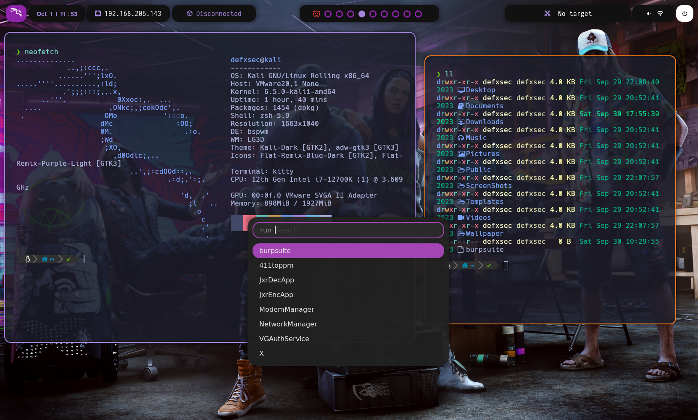

# Uso del Script

1.- Uso del Script

```bash
git clone https://github.com/defxsec/BSPWMkali.git
cd BSPWMkali
chmod +x install.sh
./install.sh
```

# Para la selección de Rofi

````bash
rofi-theme-selector


rounded-purple-dark

Alt-a

Este Script esta diseñado solo para funcionar en Kali Linux

# Shortcuts

```bash
===========================================================================================================
windows + enter abre terminal
windows + w cierra terminal
windows + d abre el buscador de aplicaciones
windows hold mover libremente la ventana
windows clic derecho reescalar libremente la ventana
windows + alt + flechas escalar ventana
windows + ctl + flechas mover ventana
control + shift + t abre pestaña en terminal
control shift alt t renombrar pestaña de terminal
control shift w cerrar pestaña de terminal
windows + "1,2,3,4,5,6,7,8,9,0" cambiar de escritorio
windows + shift + "1,2,3,4,5,6,7,8,9,0" cambiar de escritorio la ventana actual al escritorio seleccionado
============================================================================================================
````
